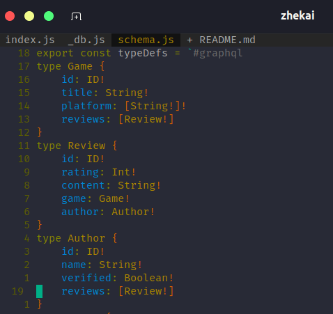
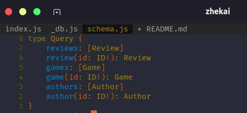
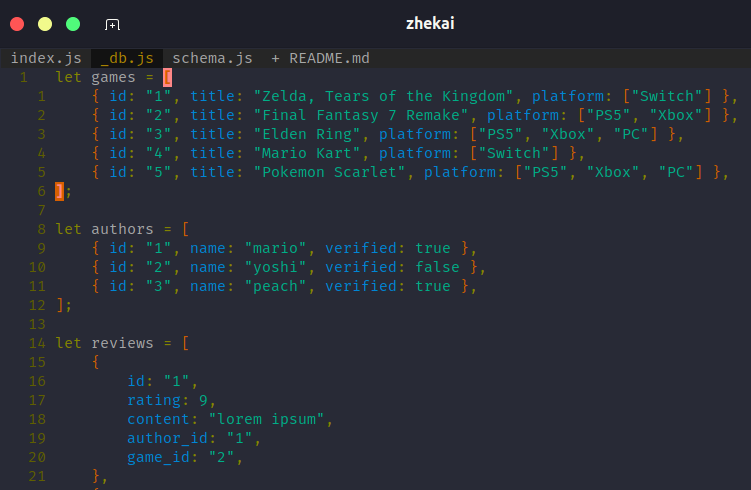

# Here are some write up of the GraphQL Tutorial

In a short way to get Apollo Server (GraphQL) up and running.
I have learned that the followings has to be defined:

-   **Schemas**
    > define the structure of the data, on how the client can query it.
-   **Data set**
    > can be data from database, REST API, hardcoded data or others.
-   **Resolver**
    > helps to communicate with Apollo Server on how to fetch the data associated with a particular type.

## Schemas

A schema is a collection of type definitions (aka **typeDefs**) that define the **shape** of queries that are executed against your data.

> This is according to definition provided by [Apollo Server Docs.](https://www.apollographql.com/docs/apollo-server/getting-started)

From what I have learned, for schema you will have to include the correct type for each of field of the dataset.

##### Therefore, what are the different types of data supported by GraphQL? The default scalar types (I was taught) were:

-   **Int**: a signed 32-bit integer
-   **Float**: a signed double-precision floating-point value
-   **String**: A UTF-8 character sequence
-   **Boolean**: **true** or **false**

##### There is also _Object types_

An object type contains a collection of fields, each of which has its own type (which may be made up by scalar types).

Two or more object types can be included in each other fields, as shown in one of my example of the scheme below (_Review_, _Game_, and _Author_ Objects):

#### The Object Type - The **_Query_**

It is a special object type that defines all of the top-level entry points for queries that clients execute against your server. Each field of the _Query_ type defines the name and the return type of a different entry point. Below is an example of the schema for Query type:

## Defining Dataset

In this tutorial, we have hardcoded a simple data set that clients can query in the **_\_db.js_** file (to simulate a database).

> This is an snapshot of the dataset (hardcoded).
